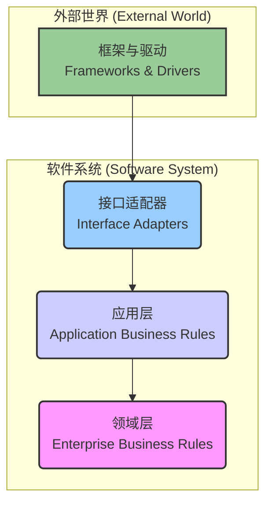

# Go Clean Architecture Blog System

本 README 文档旨在为一个基于整洁架构（Clean Architecture）原则构建的 Go 博客系统提供高级设计和开发指南。

## 1. 整洁架构设计

本项目严格遵循整洁架构思想，将系统划分为四个独立的层次，确保依赖关系始终指向内部，保证了核心业务逻辑的独立、稳定和高可测试性。



*   **领域层 (Domain Layer):** 位于架构的最核心，包含业务实体（Entities）和核心业务规则。它不依赖任何其他层。
*   **应用层 (Application Layer):** 封装和实现所有业务用例（Use Cases），通过编排领域层的实体来执行业务逻辑。此层定义了供外部使用的接口（Repositories, Services）。
*   **接口适配器层 (Interface Adapters):** 负责将数据从一种格式转换为对内层或外层最方便的格式。例如，Web Handler、中间件、DTOs 都在此层。
*   **框架与驱动层 (Frameworks & Drivers):** 包含所有外部工具和框架的具体实现，例如 Web 框架（Gin）、数据库（GORM）、缓存（Redis）等。此层实现了应用层定义的接口。

## 2. 架构师点评

从架构师视角来看，本项目是一个优秀的整洁架构实践案例，具备以下优点：

*   **高度解耦**: 各层之间通过接口和依赖倒置原则完全解耦，使得任何一层的变化都不会轻易影响到其他层，特别是核心的领域层和应用层。
*   **高可测试性**: 由于依赖关系清晰且面向接口编程，核心业务逻辑（Usecases）可以独立于数据库和UI进行单元测试，大大提高了代码质量和开发效率。
*   **技术栈无关性**: 核心业务逻辑不依赖于任何具体的技术框架。未来可以轻松地将 Gin 更换为其他 Web 框架，或将 GORM 更换为其他 ORM，而无需改动业务代码。
*   **职责清晰**: 每个目录和文件都有明确的职责，使得新开发者能够快速理解项目结构和代码意图。

## 3. 技术栈

以下技术栈被清晰地映射到对应的架构层次中：

| 技术          | 用途     | 所属层次 (Layer)           |
|---------------|----------|----------------------------|
| **Gin**       | Web 框架  | 框架与驱动 (Frameworks)    |
| **GORM**      | ORM      | 框架与驱动 (Frameworks)    |
| **Viper**     | 配置管理 | 框架与驱动 (Frameworks)    |
| **Zap**       | 日志     | 框架与驱动 (Frameworks)    |
| **MySQL**     | 数据库   | 框架与驱动 (Frameworks)    |
| **Redis**     | 缓存     | 框架与驱动 (Frameworks)    |
| **JWT**       | 认证     | 接口适配器 (Adapters)      |

## 4. 项目目录结构

```
.
├── cmd/              # 项目主入口
│   └── server/       # Web 服务器
│       └── main.go   # 程序启动、依赖注入、服务注册
├── configs/          # 配置文件 (e.g., config.yaml)
├── domain/           # 领域层 (Entities & Core Business Logic)
│   ├── article.go    # 文章实体
│   └── ...           # 其他领域实体 (User, Tag, Comment, etc.)
├── internal/         # 私有应用代码，是整个项目的核心
│   ├── application/  # 应用层 (Use Cases)
│   │   ├── usecase/  # 存放用例实现
│   │   ├── repository/ # 仓库接口定义
│   │   └── service/    # 应用服务接口定义 (e.g., Auth, Logger)
│   ├── interfaces/   # 接口适配器层
│   │   └── http/
│   │       ├── handler/    # HTTP Handlers (Controllers)
│   │       ├── middleware/ # 中间件
│   │       └── dto/        # 数据传输对象 (Data Transfer Objects)
│   └── infrastructure/ # 框架与驱动层 (Implementations)
│       ├── persistence/  # 数据持久化实现 (GORM)
│       ├── cache/        # 缓存实现 (Redis)
│       ├── log/          # 日志实现 (Zap)
│       ├── config/       # 配置实现 (Viper)
│       └── auth/         # 认证服务实现 (JWT)
├── go.mod            # Go 模块文件
└── README.md         # 项目说明文档
```

## 5. 开发与演进策略

我们采用由内向外的开发策略，确保核心逻辑的稳定性和可测试性。

1.  **定义核心领域 (Domain Layer):**
    *   创建 `domain` 目录并定义核心实体 (`Article`, `User`) 及其业务规则。

2.  **构建应用层 (Application Layer):**
    *   在 `internal/application` 中定义 `usecase` 和 `repository` 接口。
    *   为核心用例（如 `CreateArticle`）编写单元测试（配合 Mock）。

3.  **实现基础设施 (Infrastructure Layer):**
    *   在 `internal/infrastructure` 中使用 `GORM` 和 `Redis` 实现 `repository` 接口。
    *   集成 `Zap` 日志和 `Viper` 配置。

4.  **连接接口适配器 (Interface Adapters):**
    *   在 `internal/interfaces` 中创建 `http` handlers，将 API 请求通过 DTO 转换为内部模型，并调用应用层用例。

5.  **组装与启动 (CMD):**
    *   在 `cmd/server/main.go` 中完成所有组件的依赖注入（DI）并启动 `Gin` 服务器。

## 6. 未来改进方向

为了使项目更加健壮和完善，可以从以下几个方面进行改进：

*   **增加自动化测试**:
    *   **单元测试**: 为 `domain` 和 `application` 层编写完整的单元测试。
    *   **集成测试**: 为 `infrastructure` 层编写集成测试，验证与数据库、缓存等外部服务的连通性。
*   **优化错误处理**: 引入自定义错误类型，在 `handler` 层根据错误类型返回更精确的 HTTP 状态码。
*   **完善配置管理**: 将配置信息通过构造函数注入到依赖模块，而不是在模块内部直接调用配置库，以降低耦合。
*   **API 文档**: 集成 Swagger 或 OpenAPI，自动生成并提供 API 文档。
*   **增加功能**: 完善评论、标签等尚未完全实现的功能模块。

## 7. 如何开始

1.  克隆仓库
2.  安装依赖: `go mod tidy`
3.  配置 `configs/config.yaml` (特别是数据库和 JWT Secret)
4.  运行服务: `go run cmd/server/main.go`
